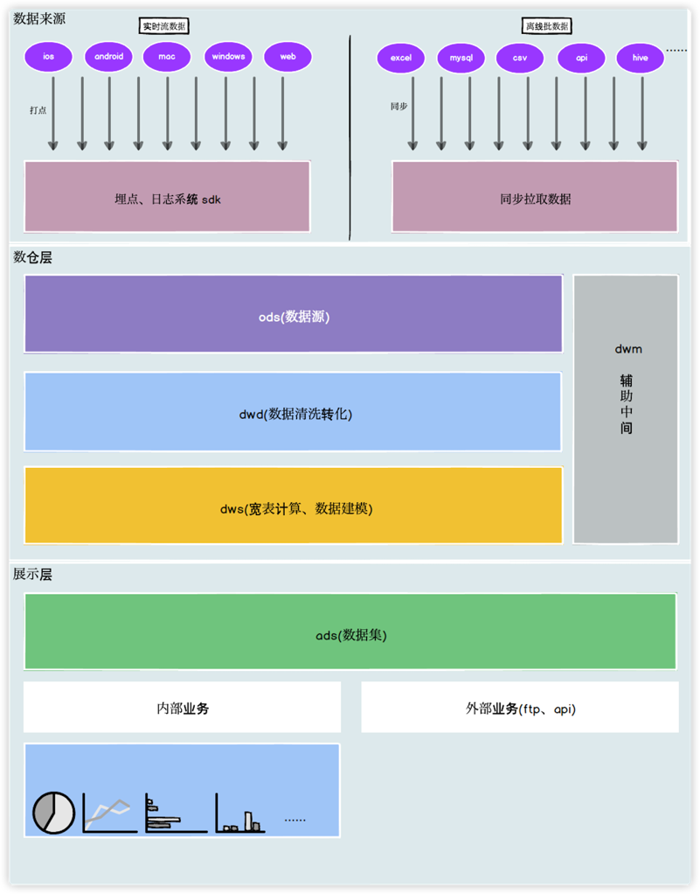
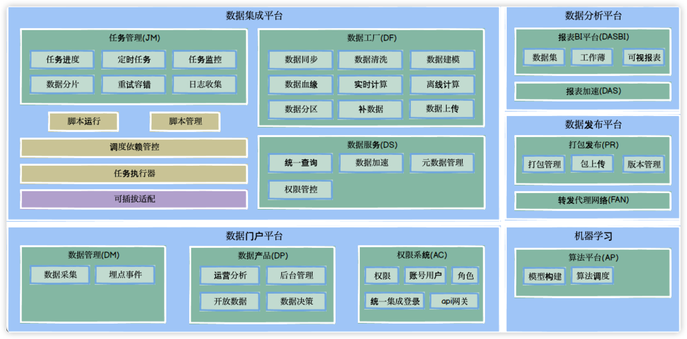

道可道,非常道.乘天地之正气,而御六气之辩.
# 项目愿景
屏蔽大数据分析重复造轮子的痛点，构建一套大数据生态带来的繁琐？好！这里就来实现一套面向olap自主灵活分析开箱即用的一站式服务。现实人人是数据分析师愿景，每一个微小的念头，都值得用数据浇灌，赋能业务。

# 技术要求
SpringBoot(2.4.5)、kafka(2.8)、zookeeper、redis、mysql、Hadoop、Spark、Hive、Hbase、phoenix、Elasticsearch、Flink、Flink-cdc、Canal、Kylin、clickhouse

备注：上述所用版本经过本人实践适配

# 代码架构分层介绍
common --- 公共层

dot-record --- 打点处理层：埋点数据接收

analysis --- 分析层：调度分析

calculate --- 计算层：核心计算

dao-tb --- 任务调度：协调任务(task-butler)

dao-driver-shell --- 执行脚本

dao-tb --- 数据工厂

# 架构分层

# 技术架构

# 服务架构

# 模型构建介绍
星型：

雪花：
# 部署方案

